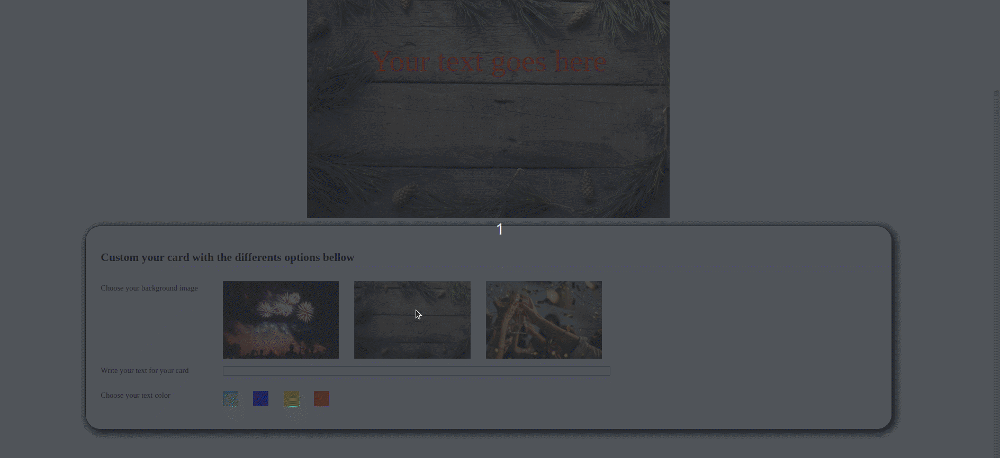

## Let's go creating your first Christmas card
You can see the preview of the result here

## First Part, the HTML structure
- 1/ Create an *index.html* with the doc type structure
- 2/ Add an h1 tag with a title
- 3/ Add a picture (One on the web : https://images.pexels.com/photos) and a p tag with the sentence 'Your text goes here'
- 4/ Add three picture, with the one you have above
- 5/ Add a form with a label and a textarea
- 6/ A p tag with the sentence 'Choose a color for your message'
- 7/ Below, just finish with 4 div with different color on their background

## Add some style
Just do it as you like it

## Create interactivity
- 1/ First, we will focus on how to change the text :
    - add an id on the p (*html*) and store the element on a variable in the *js*
    - add an id on the textarea (html) and store the element on a second variable in the *js*
    - on the textarea (*html*), add on `oninput` attribute that call a `updateText()` function
    - on the js, create a function `updateText()`
        Inside, just match the value of the p element to the textarea value

- 2/ Second, we will change the color of the text
  - Add an onClick attribute, that call a function `changeColor(#color#)` with the color as arguments on each `div`
  - On the `JS`, create a function `changeColor` that receive a *color* as argument.
  - On this function, apply the `style.color` to the p element, with the value of the received argument

- 3/ For the background image, we will apply an event listener..
  - Get the image with the background with its `id` and store it on a variable
  - Get all the 3 images with the id of an parent div (Add the div and the id if needed) with a query selector all
  - Then, use the `.forEach()` method on the array of element to add an eventListener to each of them.
  - This eventlistener (On the click), will change the *src* attribute of the backeground element with the src of the element you clicked on

